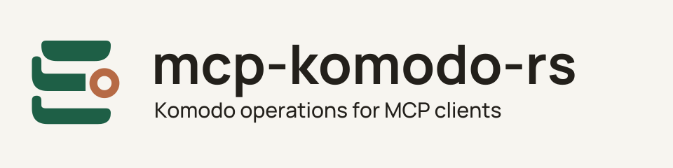

# mcp-komodo-rs

<picture>
  <source media="(max-width: 600px) and (prefers-color-scheme: dark)" srcset="docs/branding/assets/wordmark-dark.svg">
  <source media="(max-width: 600px)" srcset="docs/branding/assets/wordmark-light.svg">
  <source media="(prefers-color-scheme: dark)" srcset="docs/branding/assets/header-dark.svg">
  
</picture>

**Inspect Komodo stacks, deployments, and builds from your MCP client.**

Connect an AI assistant to [Komodo](https://komo.do/) through named tools for
status, deployment operations, and configuration changes. Start locally with
read-only status access. Add a gateway when you need authorization and approval
controls for operations that change resources or expose sensitive content.
MCP (Model Context Protocol) lets a client discover and call these tools.

**[Get started](#get-started)** · **[Documentation](docs/README.md)** ·
**[Contribute](CONTRIBUTING.md)** · **[Get help](SUPPORT.md)**

## Things to try

**Find a stack and check its state.** Use `stacks.search` to find resources, then
`stacks.status` to inspect one by name or ID. The local profile also includes
status tools for servers, deployments, builds, repositories, and operations.
[Connect a local client](docs/quickstart.md).

**Deploy a change and follow the result.** With the gateway profile and the
required authorization, call `stacks.deploy`, then use the operation receipt to
check progress. An interrupted write may already have reached Komodo;
[reconcile its outcome](docs/reconciliation.md) before trying again.

**Inspect configuration or logs when needed.** The gateway profile offers
separate tools for Compose, environment, logs, and selected configuration
changes. These can disclose sensitive data and need their own access and
approval policy. [See the tool reference](docs/tool-surface.md).

## Get started

You need Linux, Git, a C compiler/linker, Rust installed through rustup, and an
MCP client that can launch a stdio server. To inspect your resources, you also
need a reachable Komodo Core installation and read-only service-user credentials.
The tested contract is Core 2.1.2; other versions need compatibility checks.
This is an early project with no supported stable release line yet.

```sh
git clone https://github.com/chrisbennight/mcp-komodo-rs.git
cd mcp-komodo-rs
cargo build --release --locked -p komodo-server
```

The checked-in toolchain selects Rust; the first build downloads public
dependencies. The executable is `target/release/komodo-mcp-rs` (the binary name
differs from the repository name).

Add a stdio server to your client's configuration, replacing the path:

```json
{
  "mcpServers": {
    "komodo-status": {
      "command": "/absolute/path/to/mcp-komodo-rs/target/release/komodo-mcp-rs",
      "args": ["--stdio"]
    }
  }
}
```

Supply these environment variables to the child process through your client's
secret settings or launcher:

| Variable | Value to supply |
| --- | --- |
| `KOMODO_MCP_UPSTREAM_URL` | Your Core base URL, such as `https://komodo.example.com/` |
| `KOMODO_MCP_READ_API_KEY` | A read-only service-user API key |
| `KOMODO_MCP_READ_API_SECRET` | That key's secret |

The server does not load `.env` files itself. Keep credentials out of command
arguments and committed configuration. Client configuration locations and secret
interfaces vary; see the [full quickstart](docs/quickstart.md).

Connect the client and call `system.status` with `{}`. A successful response
includes `reachable: true` and your Core version. Then call `stacks.search` with
`{"limit": 10}` to find a resource. Local stdio needs no gateway or administrative
key and offers no mutations, sensitive configuration, diagnostics, or log reads.

Without a Komodo installation, you can still check the protocol using the real
binary and a loopback fake Core:

```sh
cargo test --locked -p komodo-server --test stdio
```

This checks initialization, discovery, status calls, and rejection of unavailable
operations. It does not connect to a live deployment. See
[troubleshooting](docs/quickstart.md#troubleshooting) if your client cannot connect.

## Choose an access profile

| Profile | What it provides | What it needs |
| --- | --- | --- |
| Local stdio | Ordinary status and search tools | A local process launcher and read credentials |
| Gateway HTTP | Status, deployment actions, and governed configuration, log, and secret tools | Separate read/admin credentials and a gateway implementing the identity, authorization, and approval contract |

The HTTP endpoint requires a rotating gateway bearer and a verified identity JWT
on every MCP request. A Komodo API key alone cannot authenticate an ordinary
client to it. The gateway owns per-user policy and approvals; tool annotations
do not grant access. [Configure the gateway profile](docs/gateway-setup.md).

HTTP can expose a smaller catalog with `--tool-profile status`, `read-only`, or
`operations`; the default is `full`. See the [capability matrix](docs/configuration.md#select-a-profile)
before choosing: `read-only` includes governed sensitive content and custom secrets.

The server exposes typed, bounded operations. It does not provide a raw Komodo
API proxy, arbitrary shell access, or Docker inspection. Authorized sensitive
reads can return sensitive content to the caller. Komodo may retain submitted
write content in its own traces; see the [tool contract](docs/tool-surface.md)
for the disclosure and failure semantics.

## Go further

The [documentation guide](docs/README.md) covers configuration, operation
recovery, compatibility, and the architecture. The supported container target is
Linux amd64; [builds and releases](docs/releases.md) explains image availability,
publication, and evidence. Other platforms and standalone release binaries are
not currently published.

[Get help or report a bug](SUPPORT.md) · [Contribute](CONTRIBUTING.md) ·
[Report a vulnerability](SECURITY.md) · [License](LICENSE)

## License

[MIT](LICENSE). The original project artwork uses the same license. The bundled
Manrope font retains its [SIL Open Font License](docs/branding/fonts/OFL.txt).
Rust dependency notices are described in [notice provenance](licenses/README.md).
