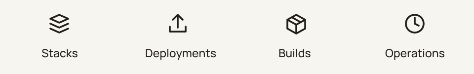

# Documentation

<picture>
  <source media="(prefers-color-scheme: dark)" srcset="branding/assets/wordmark-dark.svg">
  
</picture>

Start with [local status access](quickstart.md) to connect a stdio MCP client.
You need a Komodo installation and a read-only service user to inspect your
resources. The quickstart also includes a protocol test with a loopback fake
upstream when you want to try the binary without a deployment.

<picture>
  <source media="(prefers-color-scheme: dark)" srcset="branding/assets/capabilities-dark.svg">
  
</picture>

| I want to… | Read |
| --- | --- |
| Connect a local client | [Status-only quickstart](quickstart.md) |
| Enable authorized deployment and configuration tools | [Gateway deployment](gateway-setup.md) |
| Configure credentials, timeouts, and ingress | [Configuration reference](configuration.md) |
| Find tool names, inputs, limits, and sensitivity | [Tool surface](tool-surface.md) |
| Recover after an interrupted write | [Reconciliation](reconciliation.md) |
| Check versions and platform support | [Compatibility](compatibility.md) |
| Build or deploy a container | [Builds and releases](releases.md) |
| Understand the server's boundaries | [Architecture](architecture.md) and [decisions](../DECISIONS.md) |
| Contribute code or documentation | [Contributing](../CONTRIBUTING.md) |
| Use or update the artwork | [Visual identity](branding/README.md) |
| Ask for help or report a problem | [Support](../SUPPORT.md) and [security reporting](../SECURITY.md) |

The [initial security review](security-review.md) records the migration snapshot;
it is historical evidence, not a claim about every later dependency or image.
